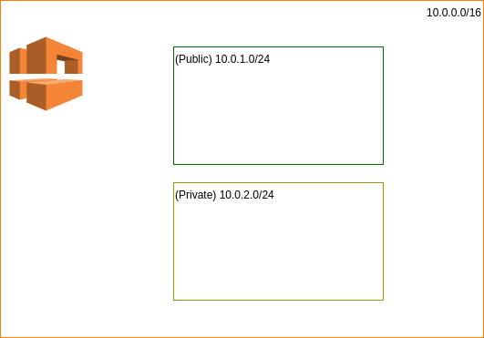

# Modules

This example shows how to create separate Terraform modules. 

The module creates a VPC as well as 2 subnets (one public and one private)
as illustrated below




As specified earlier, file names can be arbitrary, however by 
convention people will  name:

* ``main.tf`` the file where the resources specific to a module are 
  defined
* ``variables.tf`` variable declarations
* ``output.tf`` defines the output of a module that can be re-used by 
  other modules.
  
In the top [main.ts](main.tf) we basically make a module call where 
``vpc_cidr_block`` etc. are defined in [variables.tf](variables.tf)
but declared in [./modules/vpc_networking/variables.tf](./modules/vpc_networking/variables.tf)
```terraform
module "vpc_module" {
  source = "./modules/vpc_networking"
  // We are passing the variables as parameter to the sub-module.
  // Those are defined in variables.tf
  vpc_cidr_block = var.vpc_cidr_block
  public_subnet_cidr = var.public_subnet_cidr
  private_subnet_cidr = var.private_subnet_cidr
}
```

The outputs are stored declared in 
[./modules/vpc_networking/outputs.tf](./modules/vpc_networking/outputs.tf)
and can be processed as an output. 

## Executing

As usual

```shell
(testspace):module|main⚡ ⇒  terraform plan                 

An execution plan has been generated and is shown below.
Resource actions are indicated with the following symbols:
  + create

Terraform will perform the following actions:

  # module.vpc_module.aws_subnet.private_subnet will be created
  + resource "aws_subnet" "private_subnet" {
      + arn                             = (known after apply)
      + assign_ipv6_address_on_creation = false
      + availability_zone               = (known after apply)
      + availability_zone_id            = (known after apply)
      + cidr_block                      = "10.0.2.0/24"
      + id                              = (known after apply)
      + ipv6_cidr_block_association_id  = (known after apply)
      + map_public_ip_on_launch         = false
      + owner_id                        = (known after apply)
      + tags                            = {
          + "Name" = "Fakame?"
        }
      + vpc_id                          = (known after apply)
    }

  # module.vpc_module.aws_subnet.public_subnet will be created
  + resource "aws_subnet" "public_subnet" {
      + arn                             = (known after apply)
      + assign_ipv6_address_on_creation = false
      + availability_zone               = (known after apply)
      + availability_zone_id            = (known after apply)
      + cidr_block                      = "10.0.1.0/24"
      + id                              = (known after apply)
      + ipv6_cidr_block_association_id  = (known after apply)
      + map_public_ip_on_launch         = false
      + owner_id                        = (known after apply)
      + tags                            = {
          + "Name" = "Fakayu2"
        }
      + vpc_id                          = (known after apply)
    }

  # module.vpc_module.aws_vpc.module_vpc will be created
  + resource "aws_vpc" "module_vpc" {
      + arn                              = (known after apply)
      + assign_generated_ipv6_cidr_block = false
      + cidr_block                       = "10.0.0.0/16"
      + default_network_acl_id           = (known after apply)
      + default_route_table_id           = (known after apply)
      + default_security_group_id        = (known after apply)
      + dhcp_options_id                  = (known after apply)
      + enable_classiclink               = (known after apply)
      + enable_classiclink_dns_support   = (known after apply)
      + enable_dns_hostnames             = (known after apply)
      + enable_dns_support               = true
      + id                               = (known after apply)
      + instance_tenancy                 = "default"
      + ipv6_association_id              = (known after apply)
      + ipv6_cidr_block                  = (known after apply)
      + main_route_table_id              = (known after apply)
      + owner_id                         = (known after apply)
      + tags                             = {
          + "Name" = "Fakayu"
        }
    }

Plan: 3 to add, 0 to change, 0 to destroy.

------------------------------------------------------------------------

Note: You didn't specify an "-out" parameter to save this plan, so Terraform
can't guarantee that exactly these actions will be performed if
"terraform apply" is subsequently run.

```
Then
```shell
(testspace):module|main⚡ ⇒ terraform apply -auto-approve # to create
(testspace):module|main⚡ ⇒ terraform destroy -auto-approve # to delete

```
