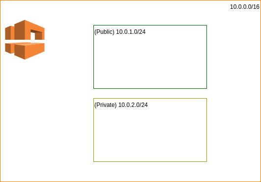
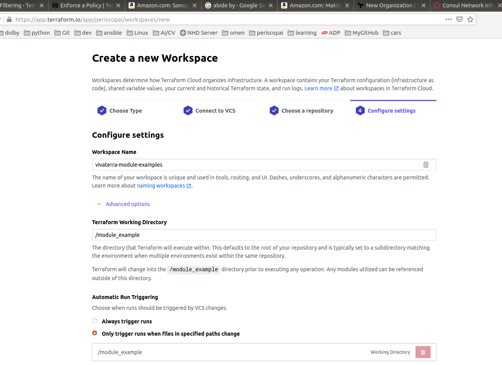
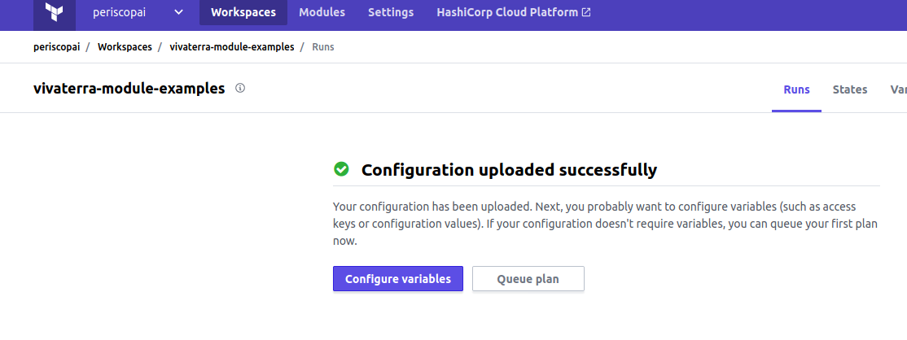
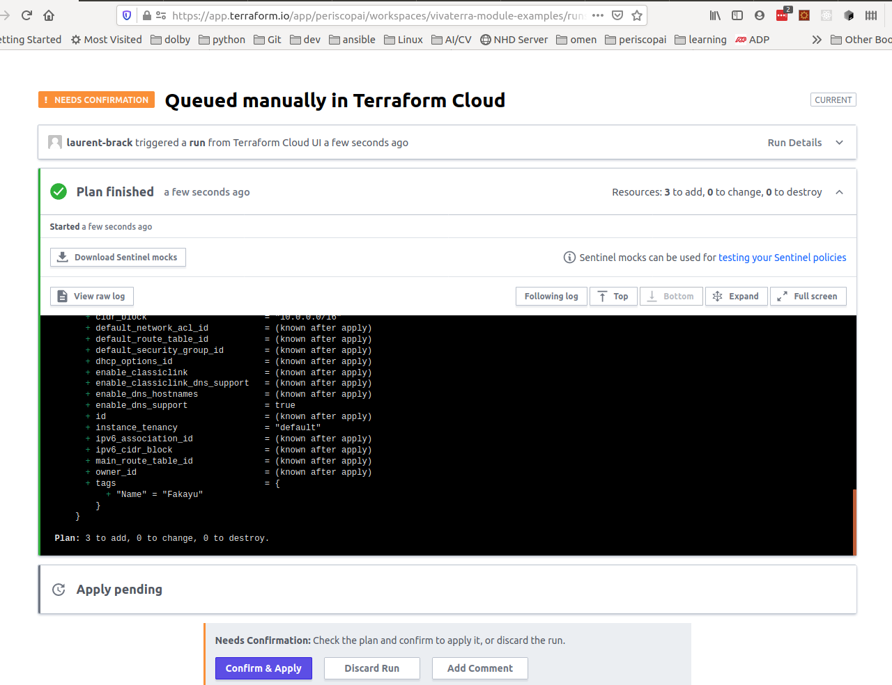
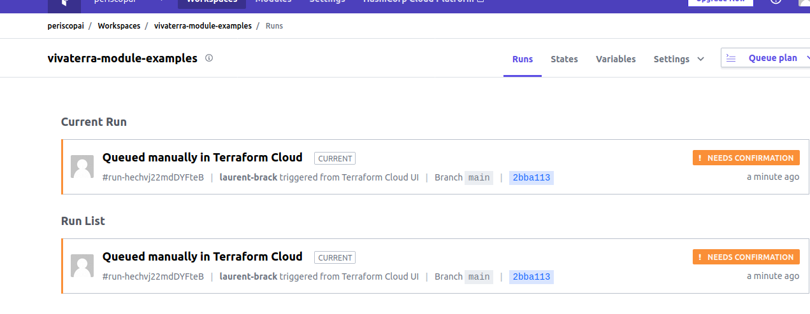
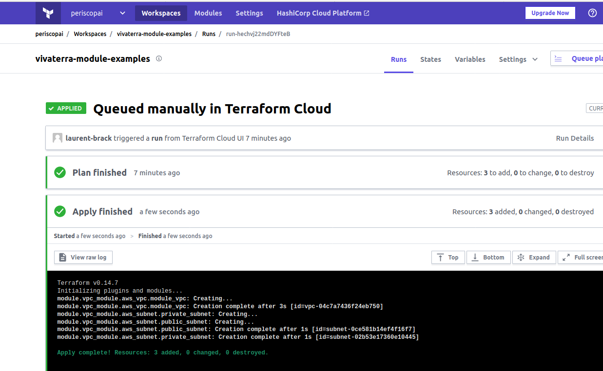

# Modules

This example shows how to create separate Terraform modules. In addition to this,
We load the "project" on 
[TerraformCLoud](https://app.terraform.io/app/periscopai/workspaces/vivaterra-module-examples/runs)
This will be covered later. 

The module creates a VPC as well as 2 subnets (one public and one private)
as illustrated below



As specified earlier, file names can be arbitrary, however by 
convention people will  name:

* ``main.tf`` the file where the resources specific to a module are 
  defined
* ``variables.tf`` variable declarations
* ``output.tf`` defines the output of a module that can be re-used by 
  other modules.
  
In the top [main.ts](main.tf) we basically make a module call where 
``vpc_cidr_block`` etc. are defined in [variables.tf](variables.tf)
but declared in [./modules/vpc_networking/variables.tf](./modules/vpc_networking/variables.tf)
```terraform
module "vpc_module" {
  source = "./modules/vpc_networking"
  // We are passing the variables as parameter to the sub-module.
  // Those are defined in variables.tf
  vpc_cidr_block = var.vpc_cidr_block
  public_subnet_cidr = var.public_subnet_cidr
  private_subnet_cidr = var.private_subnet_cidr
}
```

The outputs are stored declared in 
[./modules/vpc_networking/outputs.tf](./modules/vpc_networking/outputs.tf)
and can be processed as an output. 

## Initializaing the Workspace

If you have done so, run Terraform ``login``. This will start a browser
and have you create an API token which is then stored in 
``~/.terraform.d/credentials.tfrc.json``

The run init

```shell
module_example|main⚡ ⇒  terraform init -upgrade
Upgrading modules...
- vpc_module in modules/vpc_networking

Initializing the backend...

Initializing provider plugins...
- Finding hashicorp/aws versions matching "> 3.28.0"...
- Using previously-installed hashicorp/aws v3.31.0
...
```

in [version.tf](versions.tf), you have the 
[backend configuration](https://www.terraform.io/docs/cloud/run/cli.html#remote-backend-configuration) allowing the 
connection of this workspace with the cloud.

```terraform
backend "remote" {
    hostname      = "app.terraform.io"
    organization  = "periscopai"

    workspaces {
      name = "vivaterra-module-examples"
    }
  }
```

From that point on, the Terraform CLI will use the state stored on the 
cloud rather than the local machine. 


## Executing

This time you can run a 
[remote speculative plan](https://www.terraform.io/docs/cloud/run/cli.html#remote-speculative-plans)

```shell
(testspace):module_example|main⚡ ⇒  terraform plan
Running plan in the remote backend. Output will stream here. Pressing Ctrl-C
will stop streaming the logs, but will not stop the plan running remotely.

Preparing the remote plan...

The remote workspace is configured to work with configuration at
/module_example relative to the target repository.

Terraform will upload the contents of the following directory,
excluding files or directories as defined by a .terraformignore file
at /home/laurent/github/laurent/vivaterra/.terraformignore (if it is present),
in order to capture the filesystem context the remote workspace expects:
    /home/laurent/github/laurent/vivaterra

To view this run in a browser, visit:
https://app.terraform.io/app/periscopai/vivaterra-module-examples/runs/run-ZFT8M742BwoxvXSj

Waiting for the plan to start...

Terraform v0.14.7
Configuring remote state backend...
Initializing Terraform configuration...

An execution plan has been generated and is shown below.
Resource actions are indicated with the following symbols:
  + create

Terraform will perform the following actions:

  # module.vpc_module.aws_subnet.private_subnet will be created
  + resource "aws_subnet" "private_subnet" {
      + arn                             = (known after apply)
      + assign_ipv6_address_on_creation = false
      + availability_zone               = (known after apply)
      + availability_zone_id            = (known after apply)
      + cidr_block                      = "10.0.2.0/24"
      + id                              = (known after apply)
      + ipv6_cidr_block_association_id  = (known after apply)
      + map_public_ip_on_launch         = false
      + owner_id                        = (known after apply)
      + tags                            = {
          + "Name" = "Fakame?"
        }
      + vpc_id                          = (known after apply)
    }

  # module.vpc_module.aws_subnet.public_subnet will be created
  + resource "aws_subnet" "public_subnet" {
      + arn                             = (known after apply)
      + assign_ipv6_address_on_creation = false
      + availability_zone               = (known after apply)
      + availability_zone_id            = (known after apply)
      + cidr_block                      = "10.0.1.0/24"
      + id                              = (known after apply)
      + ipv6_cidr_block_association_id  = (known after apply)
      + map_public_ip_on_launch         = false
      + owner_id                        = (known after apply)
      + tags                            = {
          + "Name" = "Fakayu2"
        }
      + vpc_id                          = (known after apply)
    }

  # module.vpc_module.aws_vpc.module_vpc will be created
  + resource "aws_vpc" "module_vpc" {
      + arn                              = (known after apply)
      + assign_generated_ipv6_cidr_block = false
      + cidr_block                       = "10.0.0.0/16"
      + default_network_acl_id           = (known after apply)
      + default_route_table_id           = (known after apply)
      + default_security_group_id        = (known after apply)
      + dhcp_options_id                  = (known after apply)
      + enable_classiclink               = (known after apply)
      + enable_classiclink_dns_support   = (known after apply)
      + enable_dns_hostnames             = (known after apply)
      + enable_dns_support               = true
      + id                               = (known after apply)
      + instance_tenancy                 = "default"
      + ipv6_association_id              = (known after apply)
      + ipv6_cidr_block                  = (known after apply)
      + main_route_table_id              = (known after apply)
      + owner_id                         = (known after apply)
      + tags                             = {
          + "Name" = "Fakayu"
        }
    }

Plan: 3 to add, 0 to change, 0 to destroy.
```

# Terraform Cloud

In this section, we describe how to setup a workspace in Terraform Cloud and link it 
to your GitHub repos. Basically, a workspace is a portion of your repos used 
by Terraform to run IaC modules. The modules (like in this case) can be published 
directly in the workspace, or it appears to be possible to create reusable 
modules.

## Creating the Workspace

Once in TerraformCloud, [create the workspace](https://app.terraform.io/app/periscopai/workspaces)



once created, you need to setup variables. 



While you might simply run with the defaults, you must set your AWS Credentials. Those 
will be write only and are saved as secrets.

Once this is done, you can see/run a plan (as we did above)



Apply it



leading to being it applied



