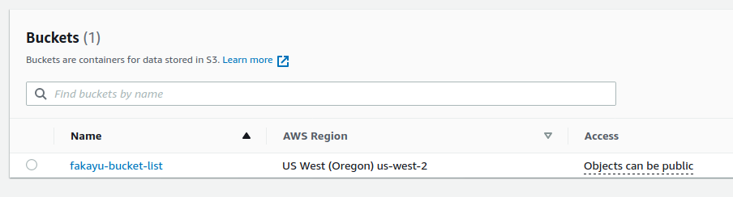

# Creating an S3 bucket

This module creates a simple S3 bucket on AWS. The content of each file is documented
in the file itself.

---

**A note about files**: There is no naming conventions aside from the extension (.tf). 
For instance, ``providers.tf`` could be named ``sausage.tf``. When Terrform executes, 
it loads each file in lexical order and merge them together. 

---

## Files

* [s3.tf](s3.tf) contains the resource declaration, that it the bucket. Because 
  a resource needs to be created in a (cloud) providers, the cloud provider is 
  defined in the next file. 
  
* [providers.tf][providers.tf] defined the provider(s) for this module. Note that 
  you could technically have more than one. 
  [Here is the list of providers](https://registry.terraform.io/browse/providers)

## Run it

1. Initialize the Root Module

    ```shell
    (testspace):s3|main⚡ ⇒  terraform init
    
    Initializing the backend...
    
    Initializing provider plugins...
    - Reusing previous version of hashicorp/aws from the dependency lock file
    - Using previously-installed hashicorp/aws v3.29.1
    
    Terraform has been successfully initialized!
    
    You may now begin working with Terraform. Try running "terraform plan" to see
    any changes that are required for your infrastructure. All Terraform commands
    should now work.
    
    If you ever set or change modules or backend configuration for Terraform,
    rerun this command to reinitialize your working directory. If you forget, other
    commands will detect it and remind you to do so if necessary.
    ```

2. Check the plan. The plan details what Terraform intends to do

    ```shell
    (testspace):s3|main⚡ ⇒  terraform plan
    
    An execution plan has been generated and is shown below.
    Resource actions are indicated with the following symbols:
      + create
    
    Terraform will perform the following actions:
    
      # aws_s3_bucket.bucket_list will be created
      + resource "aws_s3_bucket" "bucket_list" {
          + acceleration_status         = (known after apply)
          + acl                         = "private"
          + arn                         = (known after apply)
          + bucket                      = "fakayu-bucket-list"
          + bucket_domain_name          = (known after apply)
          + bucket_regional_domain_name = (known after apply)
          + force_destroy               = false
          + hosted_zone_id              = (known after apply)
          + id                          = (known after apply)
          + region                      = (known after apply)
          + request_payer               = (known after apply)
          + website_domain              = (known after apply)
          + website_endpoint            = (known after apply)
    
          + versioning {
              + enabled    = (known after apply)
              + mfa_delete = (known after apply)
            }
        }
    
    Plan: 1 to add, 0 to change, 0 to destroy.
    
    ------------------------------------------------------------------------
    
    Note: You didn't specify an "-out" parameter to save this plan, so Terraform
    can't guarantee that exactly these actions will be performed if
    "terraform apply" is subsequently run.
    ```

3. Run the plan

    ```shell
    (testspace):s3|main⚡ ⇒  terraform apply           
    
    An execution plan has been generated and is shown below.
    Resource actions are indicated with the following symbols:
      + create
    
    Terraform will perform the following actions:
    
      # aws_s3_bucket.bucket_list will be created
      + resource "aws_s3_bucket" "bucket_list" {
          + acceleration_status         = (known after apply)
          + acl                         = "private"
          + arn                         = (known after apply)
          + bucket                      = "fakayu-bucket-list"
          + bucket_domain_name          = (known after apply)
          + bucket_regional_domain_name = (known after apply)
          + force_destroy               = false
          + hosted_zone_id              = (known after apply)
          + id                          = (known after apply)
          + region                      = (known after apply)
          + request_payer               = (known after apply)
          + website_domain              = (known after apply)
          + website_endpoint            = (known after apply)
    
          + versioning {
              + enabled    = (known after apply)
              + mfa_delete = (known after apply)
            }
        }
    
    Plan: 1 to add, 0 to change, 0 to destroy.
    
    Do you want to perform these actions?
      Terraform will perform the actions described above.
      Only 'yes' will be accepted to approve.
    
      Enter a value: yes
    
    aws_s3_bucket.bucket_list: Creating...
    aws_s3_bucket.bucket_list: Creation complete after 4s [id=fakayu-bucket-list]
    
    Apply complete! Resources: 1 added, 0 changed, 0 destroyed.
    
    ```
   
    And here you go
    
   
4. Destroy the Bucket

    ```shell
    (testspace):s3|main⚡ ⇒  terraform destroy -auto-approve     
    aws_s3_bucket.bucket_list: Destroying... [id=fakayu-bucket-list]
    aws_s3_bucket.bucket_list: Destruction complete after 1s
    
    Destroy complete! Resources: 1 destroyed.
    
    ```

